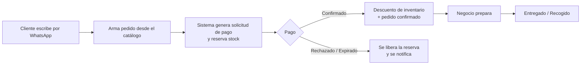

# 01-01 · Visión y Alcance

| Metadato | Valor |
|---|---|
| Documento | Visión y alcance de MysaasTech (Business OS) |
| Estado | **Vigente** |
| Versión | 1.0.0 |
| Última actualización | 2026-07-02 |
| Responsable | PM (con revisión de CTO) |
| Depende de | — (documento raíz del producto) |
| Es dependencia de | 01-02, 01-03, 01-05, 02-01, 02-02, 03-01, 07-01, y los ADR asociados |

---

## 1. Resumen ejecutivo

**MysaasTech** es un **Business Operating System (Business OS)**: una plataforma **multi-tenant, modular y white-label** sobre la que múltiples PYMES operan su negocio activando únicamente los módulos que necesitan. El producto se construye sobre un **núcleo tecnológico reutilizable** (identidad, tenancy, catálogo, pagos, notificaciones, panel) al que se le enchufan **módulos verticales** según el tipo de negocio.

La estrategia central, adoptada de forma explícita, es separar dos planos: la **arquitectura** se construye lista para plataforma desde el día 1 (multi-tenant, extensible, con pagos y región abstraídos), mientras que el **producto v1** se mantiene deliberadamente estrecho — **un vertical (restaurantes), una región (Colombia), solo los módulos del core**. Las capacidades de plataforma se encienden por fases sobre la misma arquitectura, sin reescribirla. Esta decisión está registrada en `03-11/ADR-011`.

## 2. El problema

Las PYMES colombianas (restaurantes, cafeterías, tiendas de barrio, barberías, etc.) operan hoy con herramientas fragmentadas y procesos manuales:

- **Toman pedidos por WhatsApp de forma informal**, transcribiendo a mano a un cuaderno o a la memoria, con errores y sin trazabilidad.
- **Cobran manualmente** (efectivo, un Nequi improvisado, un datáfono), sin conciliación automática entre lo que se pidió y lo que se pagó.
- **No tienen control real de inventario**: el stock se descuadra porque nada conecta la venta con el descuento de existencias.
- **Pagan por varias herramientas desconectadas** (o por ninguna) y ninguna habla con las otras.

El resultado es fuga de dinero, pedidos perdidos, tiempo administrativo desperdiciado y cero datos para decidir. No existe una capa operativa única, asequible y adaptada al canal real que usan (WhatsApp) y al contexto de pago local (Nequi y pasarelas colombianas).

## 3. Qué es MysaasTech

Un sistema operativo de negocio que unifica la operación de una PYME en una sola plataforma:

- **Multi-tenant**: una sola plataforma sirve a muchas empresas con aislamiento completo de datos entre ellas.
- **Modular**: cada negocio activa solo los módulos que necesita; no paga ni ve complejidad que no usa (*configuración sobre personalización*).
- **White-label**: la arquitectura permite que cada empresa (o un revendedor) opere bajo su propia marca.
- **Region-ready**: la lógica dependiente del país (pagos, impuestos, protección de datos, locale) vive en *region packs* configurables, no hardcodeada.
- **Canal nativo WhatsApp**: el cliente final interactúa por WhatsApp (Meta Cloud API directa); el negocio opera desde un panel web.

## 4. Filosofía y estrategia de producto

**Las plataformas horizontales exitosas se *extraen* de un vertical validado; no se diseñan universales en el vacío.** Intentar construir el núcleo para 12 verticales antes del primer cliente pagando es el principal riesgo de no lanzar nunca. Por eso:

1. **Arquitectura plataforma-ready (se construye bien desde el inicio).** Multi-tenancy, sistema de módulos, abstracción de pagos y de región, y las costuras de white-label. Estas decisiones son *puertas de una sola vía* (caras de revertir), así que se hacen con rigor ahora. (`03-11/ADR-002`, `ADR-008`, `ADR-003`, `ADR-010`.)
2. **Producto v1 estrecho (se valida rápido).** Un vertical, una región, módulos del core. El objetivo de v1 es **cerrar el ciclo con restaurantes reales que paguen**, no demostrar amplitud.
3. **Costuras (seams) baratas hoy donde el cambio futuro es probable y caro.** El ejemplo canónico es el flujo operativo (ver §5): "pedidos" se implementa como **módulo**, no como concepto del núcleo, de modo que verticales de otra naturaleza puedan enchufar su propio flujo sin tocar el core.

Esta filosofía es coherente con las restricciones reales del proyecto: equipo mínimo (una persona + Claude Code), apalancado en servicios gestionados (Supabase, Vercel). La carga operativa es la restricción dominante, y toda decisión favorece lo simple de operar.

## 5. Principio arquitectónico clave: el núcleo es agnóstico al flujo

El flujo operativo confirmado para v1 es un flujo de **comercio/pedido**. Pero las verticales objetivo se dividen en **dos familias** con flujos distintos:

| Familia | Flujo primario | Verticales | Módulo primario |
|---|---|---|---|
| **Comercio / pedido** | cliente → pedido → pago → preparar → entregar | Restaurantes, cafeterías, panaderías, minimercados, licorerías, tiendas físicas | Módulo **Pedidos** |
| **Agenda / reserva** | cliente → agendar cita/reserva → (anticipo) → asistir | Barberías, peluquerías/salones, gimnasios, consultorios, hoteles | Módulo **Reservas** (futuro) |

**Decisión de diseño:** el núcleo (identidad, tenancy, catálogo de productos/servicios, pagos, notificaciones WhatsApp, panel) **no asume "pedido" como concepto central**. "Pedidos" es el **primer módulo vertical**; "Reservas" será otro. Así, la promesa de que la plataforma sirva mañana a barberías, peluquerías u hoteles queda garantizada por la arquitectura, no por una intención. El detalle de la matriz vertical × módulo está en `01-05`.

## 6. Objetivos y no-objetivos

### 6.1 Objetivos de v1 (medibles, a validar)

- **O1 — Cerrar el ciclo operativo sin intervención manual.** Que el flujo pedido → pago → descuento de inventario → notificación funcione de punta a punta para > 95 % de los pedidos, sin que el negocio tenga que transcribir ni conciliar a mano.
- **O2 — Restaurantes reales pagando.** Conseguir los primeros 3–5 restaurantes con suscripción activa como validación de que el producto resuelve un dolor por el que pagan.
- **O3 — Onboarding operable por una persona.** Dar de alta un tenant nuevo (crear tenant, configurar catálogo, conectar credenciales de pago y WhatsApp) en un trabajo manual acotado y repetible; el quinto onboarding debe ser sustancialmente más rápido que el primero.
- **O4 — Aislamiento verificable entre tenants.** Cero fugas de datos entre empresas, demostrable mediante pruebas automatizadas de aislamiento (`06-01`).

### 6.2 No-objetivos de v1 (diferidos, no descartados)

Se listan explícitamente para blindar el alcance:

- **No** se construye el módulo de **Reservas/citas** (familia agenda) en v1. La arquitectura lo permite; el producto no lo incluye todavía.
- **No** se activan **otras verticales**. El sistema de módulos existe, pero solo se cargan los módulos de restaurantes.
- **No** hay **white-label profundo** en v1: la arquitectura soporta theming y resolución de tenant desde el día 1, pero el producto solo expone **branding básico** (logo y colores por tenant). Dominios personalizados y portal de revendedor se difieren.
- **No** hay **multi-región activa**: solo el *region pack* de Colombia. La costura de regionalización existe; solo se implementa CO.
- **No** hay **servicio en mesa / comandas dine-in** (mozo, mesa, cuenta por mesa). Confirmado con el owner (D-6): el flujo de v1 es para-llevar/domicilio (`cliente → pedido → pago → preparar → entregar/recoger`), por ser el más simple y el que mejor encaja con lo ya diseñado. El modo dine-in se difiere al módulo de restaurantes ampliado.
- **No** se construye **app móvil nativa**. El panel del negocio es web responsive; el canal del cliente final es WhatsApp.
- **No** hay integración con **hardware POS / impresoras fiscales** en v1.

### 6.3 No-objetivos permanentes

- **La plataforma nunca custodia dinero ni actúa como agregador de pagos.** Cada tenant usa sus propias credenciales de pasarela y los fondos llegan directo a su cuenta. Esto evita el rol de agregador ante la Superintendencia Financiera y es una restricción de diseño, no una decisión de v1. (`03-11/ADR-003`, `04-04`.)

## 7. Alcance

### 7.1 Alcance de producto (v1)

- **Vertical:** restaurantes (extensible a comercio/pedido).
- **Región:** Colombia.
- **Canal del cliente final:** WhatsApp (Meta Cloud API directa).
- **Flujo operativo:** cliente → WhatsApp → pedido → pago → preparar → entregar.
- **Módulos del core activos:** identidad y tenancy, catálogo, **pedidos**, pagos, inventario, notificaciones WhatsApp, panel del negocio.

### 7.2 Alcance de arquitectura (se construye bien aunque el producto sea estrecho)

- **Multi-tenancy** con aislamiento por RLS (nivel por defecto) y aislamiento dedicado opcional para tiers superiores (`03-02`, `ADR-002`).
- **Sistema de módulos y entitlements**: activación de módulos por tenant/vertical (`03-04`, `ADR-008`).
- **Capa de pagos multi-pasarela**: abstracción que hoy implementa Nequi y admite Wompi/Mercado Pago/PayU/ePayco después sin reescribir la máquina de estados (`03-07`, `ADR-003`).
- **Costuras de white-label**: tokens de tema y resolución de tenant (`03-09`, `ADR-009`).
- **Costuras de regionalización**: estructura de *region packs* (`03-10`, `ADR-010`).

### 7.3 Fuera de alcance (diferido a fases posteriores)

Módulo de reservas, verticales de agenda (barberías, peluquerías, gimnasios, consultorios, hoteles), verticales de comercio adicionales (cafeterías, panaderías, minimercados, licorerías, tiendas), white-label profundo (dominios y portal de revendedor), regiones distintas a Colombia, app móvil nativa, hardware POS. El roadmap de encendido por fases está en `07-01`.

## 8. Usuarios (visión general)

El detalle de personas y jobs-to-be-done está en `01-02`. A alto nivel:

- **Dueño de la PYME** — configura y supervisa; quiere ver ventas, inventario y pedidos sin fricción.
- **Personal / cajero** — opera el día a día; atiende y despacha pedidos.
- **Cliente final** — pide y paga por WhatsApp; quiere rapidez y confirmación clara.
- **Operador de la plataforma** (rol de negocio del proyecto) — da de alta tenants, mantiene integraciones, opera la infraestructura.
- **Revendedor white-label** (futuro) — ofrece la plataforma bajo su propia marca a sus clientes.

## 9. Flujo operativo de v1

Notas de diseño que se detallan en documentos posteriores:

- El **stock se reserva al generar la solicitud de pago**, no al confirmar, y la reserva expira si el pago no llega (`03-11/ADR-006`, `03-05`).
- El pago **no se da por confirmado solo por el webhook**: se consulta el estado en la pasarela (`getstatus`) antes de descontar inventario (`03-07`).
- El descuento de inventario es **atómico** para evitar condiciones de carrera (`03-03`, `03-05`).

## 10. Modelo de negocio (visión general)

El detalle está en `01-03`. A alto nivel: **suscripción recurrente por tenant**, con módulos incluidos según plan y add-ons por módulo; un tier de **revendedor/white-label** en fases posteriores. El principio de no-agregador se mantiene: la plataforma cobra por el software, no por el flujo de dinero del negocio. Colombia primero; pricing en moneda local.

## 11. Criterios de éxito de v1

- El ciclo pedido→pago→inventario→notificación opera sin intervención manual en la mayoría de los pedidos (O1).
- Existen restaurantes pagando la suscripción (O2).
- El onboarding de un tenant es repetible y cada vez más rápido (O3).
- Las pruebas de aislamiento multi-tenant pasan en CI (O4).

Métricas operativas y de negocio detalladas (activación, retención, MRR, churn) se definen junto al modelo de negocio en `01-03`.

## 12. Supuestos y restricciones

- **Equipo:** una persona + Claude Code como par de desarrollo. La carga operativa es la restricción dominante; se favorecen servicios gestionados (Supabase, Vercel).
- **Stack:** React + Vite + Tailwind (panel), Supabase (Postgres/Auth/Storage/Edge Functions), Vercel, GitHub (`JuanMacias18`), Meta Cloud API directa.
- **Dependencias externas fuera de control:** los tiempos de aprobación de **Nequi Negocios** y de **verificación de WhatsApp Business (Meta)** por cada negocio no dependen del proyecto y deben incorporarse como pasos tempranos del proceso de venta/onboarding.
- **Fricción de billing con Anthropic** (rechazo de tarjeta, impuesto a servicios digitales foráneos) es una restricción operativa conocida para el uso de la API en herramientas del ciclo de desarrollo.

## 13. Riesgos principales

| Riesgo | Impacto | Mitigación |
|---|---|---|
| **Scope creep hacia lo horizontal** (construir para 12 verticales antes de vender) | Alto — no lanzar nunca | ADR-011: arquitectura plataforma-ready, producto v1 estrecho; no-objetivos §6.2 blindados. |
| **Fuga de datos entre tenants** (error de RLS) | Crítico — datos de terceros bajo Ley 1581; letal para white-label | RLS como amenaza #1 (`04-02`); pruebas de aislamiento de primera clase (`06-01`); aislamiento por niveles (`03-02`). |
| **Cuello de botella de onboarding a escala** (verificar una WABA por tenant a mano) | Medio-alto | Decisión Meta directo vs BSP reabierta con criterio de disparo (`03-08`, D-3). |
| **Dependencia de terceros** (pasarela, Meta) que no responden | Medio | Diseño para el fallo: timeouts, reintentos idempotentes, degradación (`03-06`, `03-07`). |

## 14. Decisiones y documentos relacionados

- `03-11/ADR-011` — Alcance v1: un vertical, una región; arquitectura plataforma-ready. **(Validado por el owner.)**
- `03-11/ADR-002` — Arquitectura multi-tenant con RLS (reemplaza la decisión previa de instancia aislada por cliente).
- `03-11/ADR-008` — Sistema de módulos y entitlements.
- `01-05` — Verticales y matriz de módulos (materializa la estrategia de las dos familias).
- `07-01` — Roadmap y fases (encendido de verticales, white-label y regiones).

---

*Documento vigente. Siguiente en el orden de entrega: `01-02-usuarios-y-jtbd.md`.*
