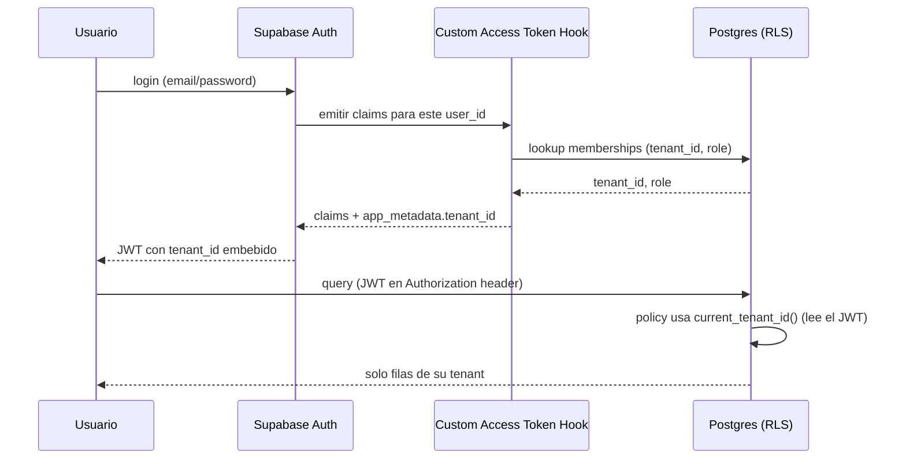

# 03-02 · Tenancy y Aislamiento

| Metadato | Valor |
|---|---|
| Documento | Tenancy y aislamiento multi-tenant |
| Estado | **Vigente** |
| Versión | 1.0.0 |
| Última actualización | 2026-07-02 |
| Responsable | CTO |
| Depende de | `ADR-002`, `ADR-007` (nota C7), `01-04` (glosario). **No** depende de `03-01` (C4): ese documento se redacta post-v1, describiendo el sistema ya real (`00-INDEX` §9) — aquí no se asume su existencia. |
| Es dependencia de | `03-03`, `03-04`, `04-01`, `04-02`, `05-02`, `05-05`, `06-01`, y las tareas T2.1/T2.3 del plan de entrega |

---

## 1. Alcance y principio rector

Este documento define **cómo** se implementa el aislamiento multi-tenant decidido en `ADR-002`: **shared-schema + Row Level Security (RLS) como único mecanismo de aislamiento en v1**. La seguridad y el aislamiento entre tenants es el principio #1 del proyecto cuando entra en conflicto con cualquier otro (`00-INDEX` §1) — este documento es, por tanto, el más consultado y el más estricto en cuanto a "sin ambigüedad" del catálogo.

Todo lo aquí descrito se valida con pruebas ejecutables (pgTAP, FF-1, FF-2) desde el walking skeleton (Fase 2 del plan), no solo con esta prosa.

## 2. Modelo de aislamiento por niveles

| Nivel | Estado | Mecanismo |
|---|---|---|
| **Shared-schema + RLS** (v1, único implementado) | Construido en T2.1 | Una sola base Postgres; toda tabla de negocio lleva `tenant_id`; RLS filtra filas por tenant en cada policy. |
| **Esquema o base dedicada** (enterprise, futuro) | **Costura sin código** (nota C7 de `ADR-002`) | No se construye hasta que exista un contrato enterprise real que lo exija. |

Para que el nivel dedicado sea agregable después **sin reescribir el núcleo**, estas reglas se respetan desde ya aunque hoy solo exista un nivel:

- Todo identificador es `uuid` generado aleatoriamente (`gen_random_uuid()`), nunca autoincremental — un ID nunca revela ni depende de en qué "instancia" vive su fila.
- La resolución de tenant es **un solo punto centralizado** (§3): el día que un tenant dedicado exista, solo ese punto cambia (para enrutar a otra conexión/esquema), no cada query de la aplicación.
- Ningún código de `apps/` o `packages/` abre conexiones a Postgres por su cuenta; todo pasa por el cliente tipado de `packages/core`, que es el único lugar que tendría que aprender a enrutar por tenant dedicado.

No construir el nivel dedicado hoy es una decisión deliberada, no una omisión (`01-01` §4, principio de costuras baratas).

## 3. Resolución de tenant

### 3.1 Modelo de datos (mínimo, ampliado en `03-03`)

- **`tenants`**: una fila por negocio.
- **`memberships`**: relación `(tenant_id, user_id, role)` — un usuario puede pertenecer a más de un tenant (modelo preparado para revendedor white-label futuro), aunque **en v1 cada usuario opera en la práctica un solo tenant** (simplificación de producto, no de esquema — no hace falta migrar nada cuando esto cambie).
- El rol (`admin` | `staff`) vive en `memberships`, no en `auth.users`: la autorización siempre se evalúa "para este tenant, qué rol tiene este usuario", nunca de forma global.

### 3.2 El tenant viaja en el JWT, no se resuelve por query en cada request

PostgREST (la capa que expone Postgres vía la API de Supabase) es *stateless* por request: no hay forma de "elegir tenant" a mitad de una consulta salvo que el dato ya venga en el JWT. Por eso:

1. Al emitir el token (login, o refresh), un **Custom Access Token Hook** de Supabase Auth (función Postgres registrada en la configuración de Auth) agrega el `tenant_id` de la membership del usuario como claim en `app_metadata` del JWT.
   *(Nota de implementación para T2.1: verificar la firma exacta del hook contra la versión vigente de Supabase Auth al codificarlo — esta API evoluciona.)*
2. Toda policy de RLS lee ese claim mediante una función estable, nunca vía JOIN contra `memberships` en cada fila (ver rendimiento, §4).
3. El **panel**, tras login, sí consulta sus propias `memberships` (protegidas por RLS: "el usuario ve sus propias membresías") para decidir/mostrar en qué tenant está operando — pero esa consulta es para la UI, no la fuente de verdad que hace cumplir el aislamiento. La fuente de verdad es siempre el claim del JWT usado en cada request subsecuente.
4. Si un usuario pertenece a más de un tenant (caso futuro), "cambiar de tenant" implica volver a emitir el token con el claim actualizado — no algo que v1 necesite resolver todavía.



### 3.3 `current_tenant_id()`

Función estable que toda policy usa para obtener el tenant de la request actual:

```sql
create or replace function public.current_tenant_id()
returns uuid
language sql
stable
as $$
  select nullif(auth.jwt() -> 'app_metadata' ->> 'tenant_id', '')::uuid
$$;
```

`stable` (no `volatile`): Postgres puede evaluarla una sola vez por consulta en vez de por fila — ver §4.

## 4. RLS: mecanismo y patrón de policies

Patrón estándar para toda tabla de negocio (`tenant_id uuid not null references tenants(id)`):

```sql
alter table public.<tabla> enable row level security;

create policy "aislamiento por tenant"
  on public.<tabla> for all
  using (tenant_id = public.current_tenant_id())
  with check (tenant_id = public.current_tenant_id());

-- RLS restringe FILAS, pero Postgres exige ademas el privilegio de
-- tabla de base para el rol; sin este GRANT, toda query falla con
-- "permission denied" antes de llegar a evaluar la policy (hallazgo
-- de T2.1). service_role tambien lo necesita: bypassa RLS, pero NO
-- el GRANT (hallazgo de T2.2, al conectar el primer webhook real).
grant select, insert, update, delete on public.<tabla> to authenticated, service_role;
```

Reglas no negociables (idénticas a `CLAUDE.md` regla #3, aquí con el detalle técnico):

- **Deny-by-default**: `enable row level security` en la **misma migración** que crea la tabla. Sin policy, RLS deniega todo por defecto — nunca se deja una tabla sin RLS "para después". El `grant` de arriba es necesario pero no suficiente: sin las policies, el rol tiene el privilegio pero ninguna fila pasa el filtro.
- **Prohibido `using (true)`** salvo una lista blanca explícita de tablas de referencia verdaderamente públicas (p. ej. catálogos globales sin dato de negocio). FF-2 la hace cumplir en CI (script que falla si detecta RLS deshabilitado o `using (true)` fuera de la lista blanca).
- **Índices liderados por `tenant_id`**: todo índice compuesto relevante empieza por `tenant_id` (`create index on <tabla> (tenant_id, <columna>)`), porque toda query ya filtra por tenant primero.
- **Funciones estables, no reevaluación por fila**: `current_tenant_id()` es `stable`, y dentro de policies se evita volver a llamar `auth.uid()`/`auth.jwt()` sueltos por cada fila — el patrón de arriba ya lo resuelve al envolver la lectura del JWT en una única función estable reutilizada.

## 5. Bordes filosos de RLS en Supabase (hallazgo C5 de la auditoría — no negociables)

### 5.1 `service_role` ignora RLS por completo

La `service_role` key bypassa RLS a nivel de conexión. Regla: **solo vive server-side** (Edge Functions en `supabase/functions/`), **nunca** en `apps/` ni `packages/` (FF-3 lo bloquea en CI), y solo se usa cuando el JWT del usuario no alcanza (p. ej. un webhook de pasarela que no tiene sesión de usuario). Toda Edge Function que la use filtra explícitamente por `tenant_id` en cada query y documenta el motivo con un comentario `// WHY` (`CLAUDE.md` regla #4).

### 5.2 Storage: el aislamiento no termina en las tablas

Los buckets de Supabase Storage tienen su propio sistema de policies (sobre `storage.objects`), independiente de las tablas. Convención del proyecto: cada archivo vive bajo un prefijo `{tenant_id}/...` dentro del bucket, y la policy verifica ese prefijo:

```sql
create policy "tenant lee sus propios archivos"
  on storage.objects for select
  using (
    bucket_id = 'product-images'
    and (storage.foldername(name))[1] = public.current_tenant_id()::text
  );
```

Sin esta policy explícita por bucket, un tenant podría leer o sobrescribir archivos de otro aunque las tablas estén perfectamente aisladas.

### 5.3 Realtime: los canales deben respetar RLS

Una suscripción de Realtime (Postgres Changes) sobre una tabla con RLS debe autorizarse con el mismo criterio que una query normal — no es automático en todas las configuraciones. Antes de exponer cualquier canal Realtime a datos de negocio, el walking skeleton (Fase 2) debe verificar empíricamente que un usuario del tenant A no recibe eventos del tenant B por ese canal. Si la verificación falla, no se habilita Realtime para esa tabla hasta resolverlo — no es opcional.

### 5.4 Rendimiento de policies

Cubierto en §4: índices liderados por `tenant_id` + `current_tenant_id()` como función `stable`. Sin esto, cada fila reevalúa la policy y el costo crece linealmente con el tamaño de la tabla, no con el resultado filtrado.

### 5.5 Restauración por tenant en base compartida

Un PITR (point-in-time recovery) restaura **toda** la base a la vez: no existe hoy un mecanismo para restaurar un solo tenant sin afectar a los demás. Esto es un hueco reconocido, no resuelto aquí — se cierra en `05-05` (Respaldo y recuperación), que debe decidir explícitamente entre (a) exports lógicos por tenant como mecanismo aparte, o (b) aceptar un RTO/RPO distinto y documentado para el escenario "restaurar un solo tenant". Mientras `05-05` no esté Vigente, cualquier incidente que requiera restaurar un tenant individual se trata como incidente de todo el sistema.

### 5.6 Una policy no puede consultar una tabla protegida por RLS "desde adentro" sin ayuda

Hallazgo de T2.1 (validado por los tests de aislamiento, no anticipado en la auditoría original): cuando la `USING`/`WITH CHECK` de una policy sobre la tabla `X` necesita consultar la propia tabla `X` (o otra tabla con RLS) para decidir algo distinto de "una fila mía", esa subconsulta corre **con los privilegios y la RLS del rol que llama** — no con privilegios elevados. Dos síntomas concretos, ambos encontrados al implementar `03-03`:

- **La subconsulta ve menos de lo que la policy necesita.** La policy de `profiles` que permite leer perfiles de compañeros de tenant hacía un `JOIN` contra `memberships`; como `memberships` solo dejaba ver "mis propias membresías", el `JOIN` nunca encontraba la fila del compañero y la policy denegaba siempre.
- **Postgres rechaza la auto-referencia directamente.** Una policy de `memberships` que consulta `memberships` dentro de su propio `WITH CHECK` (para verificar "¿soy admin de este tenant?") dispara `ERROR: infinite recursion detected in policy for relation "memberships"`.

**Solución (aplicada en `03-03` §2.3/§4):** envolver esa subconsulta en una función `security definer` (`stable`, `set search_path = public`). Al ejecutarse con los privilegios de quien la define (no de quien la invoca), la función ve la tabla sin la restricción de RLS que bloquearía la consulta, y al ser una función separada (no una subconsulta inline sobre la misma relación) Postgres no la trata como auto-referencia recursiva. Patrón general:

```sql
create or replace function public.<nombre_del_chequeo>(<argumentos>)
returns boolean
language sql
stable
security definer
set search_path = public
as $$
  select exists (
    select 1 from public.<tabla_protegida> ...
  )
$$;

create policy "..."
  on public.<tabla> for <operacion>
  using (public.<nombre_del_chequeo>(...));
```

Regla general para el resto del proyecto: **toda policy cuya condición necesite mirar más allá de "esta fila me pertenece" — cruzar con otra tabla, o consultar la misma tabla desde otro ángulo — se escribe como función `security definer`, nunca como subconsulta inline.** Esto no es un parche puntual de `profiles`/`memberships`; es el patrón a seguir en `03-04` en adelante (p. ej. la FSM de pedidos y las policies de catálogo probablemente lo necesiten).

## 6. Blast radius y mitigaciones

| Riesgo | Mitigación | Dónde se implementa |
|---|---|---|
| Migración mala afecta a todos los tenants a la vez (esquema compartido) | Migraciones probadas contra `supabase db reset` + staging antes de `main`; migraciones inmutables una vez en `main` | `05-03`, `CLAUDE.md` regla #6 |
| Bug de RLS filtra datos entre tenants | Pruebas de aislamiento como categoría de primera clase (FF-1), no una fase de QA posterior | `06-01`, T2.1 |
| Vecino ruidoso (un tenant con volumen anómalo degrada a los demás) | Tolerable en v1 (3-5 restaurantes); métricas por tenant para vigilar antes de que sea un problema real | `05-04` |
| Restauración no aislada por tenant | Ver §5.5 — hueco reconocido, se cierra en `05-05` | `05-05` |

## 7. Roles dentro de un tenant

`memberships.role` define la autorización dentro de un tenant: `admin` (gestiona catálogo, ve reportes, invita personal) vs. `staff` (opera pedidos del día a día, sin acceso a configuración ni reportes financieros). El detalle funcional de qué puede hacer cada rol es un requisito de producto y se define en `02-01`; este documento solo fija el mecanismo: toda policy que distinga por rol lee `(select role from memberships where tenant_id = current_tenant_id() and user_id = (select auth.uid()))`, envuelto igual que `current_tenant_id()` para mantener el mismo patrón de rendimiento.

## 8. Pruebas de aislamiento (FF-1, FF-2)

Casos obligatorios que **deben fallar en rojo antes de existir la policy**, y quedar verdes después (patrón TDD-RLS de T2.1, simulando cada JWT con `set local request.jwt.claims`):

1. Un usuario del tenant A no lee filas del tenant B (`select`).
2. Un usuario del tenant A no escribe en el tenant B (`insert`/`update`/`delete`).
3. Un usuario sin `membership` no lee nada.
4. Un rol `staff` no puede hacer lo que un `admin` sí puede.

FF-1 (esta suite en CI) y FF-2 (script que falla si alguna tabla nueva tiene RLS deshabilitado o una policy `using (true)` fuera de la lista blanca) quedan activas desde el primer commit que crea una tabla de negocio (T2.1) y protegen todo el desarrollo posterior. El detalle de estrategia de pruebas (pirámide completa, no solo aislamiento) vive en `06-01`.

## 9. No-objetivos de este documento

- No implementa el nivel de aislamiento dedicado (queda como costura, §2).
- No define qué puede hacer cada rol en términos de producto (eso es `02-01`).
- No cierra la estrategia de restauración por tenant (eso es `05-05`, §5.5).
- No incluye el ERD completo del núcleo (tenants, memberships, event_log con todas sus columnas) — eso es `03-03`, el siguiente documento del orden DMV.

## 10. Decisiones y documentos relacionados

- `03-11/ADR-002` — Arquitectura multi-tenant con RLS (Aceptado).
- Hallazgo C7 de `AUDITORIA-business-os.md` — nota "solo costura" para el aislamiento dedicado.
- Hallazgo C5 de `AUDITORIA-business-os.md` — origen de los cinco bordes filosos de §5.
- `03-03` — modelo de datos y ERD del núcleo (siguiente en el orden DMV).
- `06-01` — estrategia de pruebas (sección de aislamiento).

---

*Documento vigente. Aprobado por el owner el 2026-07-02, incluyendo el mecanismo de resolución de tenant vía JWT + Custom Access Token Hook (§3) y la convención de paths por tenant en Storage (§5.2).*
