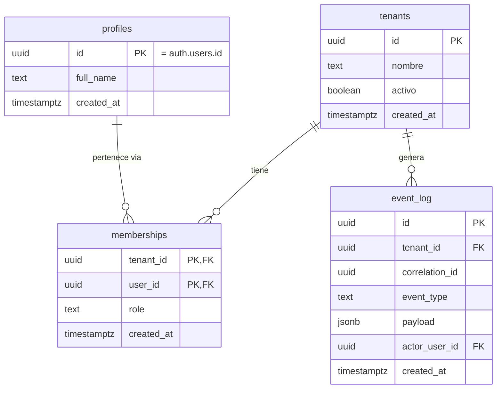

# 03-03 · Modelo de Datos y ERD (núcleo)

| Metadato | Valor |
|---|---|
| Documento | Modelo de datos y ERD — núcleo |
| Estado | **Vigente** |
| Versión | 1.0.0 (alcance: solo núcleo; se amplía en fases posteriores, ver §7) |
| Última actualización | 2026-07-02 |
| Responsable | CTO |
| Depende de | `03-02` (mecanismo de RLS y `current_tenant_id()`), `01-04` (glosario) |
| Es dependencia de | `03-04`, `03-05`, `04-01`, `06-01`, y la tarea T2.1 del plan de entrega |

---

## 1. Alcance de esta versión

Este documento cubre **exclusivamente el núcleo**: `tenants`, `profiles`, `memberships`, `event_log`. Es la Documentación Mínima Viable que T2.1 necesita para construir el walking skeleton (`00-INDEX` §1.1). Catálogo, inventario, pedidos, pagos y mensajes **no están aquí** — cada uno amplía este documento *just-in-time*, en la fase donde se codifica (mapa doc→fase, `00-INDEX` §9 / `PLAN-DE-ACCION-claude-code.md` §9):

| Fase | Qué se añade a este documento |
|---|---|
| 3 | Catálogo e inventario básico |
| 4 | `orders`, `order_items`, `stock_reservations` |
| 5 | Entidades de la capa de pagos (referencias, no datos de tarjeta) |
| 6 | Mensajería / estado de conversación de WhatsApp |

## 2. Entidades del núcleo

### 2.1 `tenants`

```sql
create table public.tenants (
  id          uuid primary key default gen_random_uuid(),
  nombre      text not null,
  activo      boolean not null default true,
  created_at  timestamptz not null default now()
);
```

Una fila por negocio. No lleva `tenant_id` (es la raíz de aislamiento, no un hijo de ella).

### 2.2 `profiles`

```sql
create table public.profiles (
  id          uuid primary key references auth.users(id) on delete cascade,
  full_name   text,
  created_at  timestamptz not null default now()
);
```

Espejo mínimo de `auth.users` en el schema `public` (patrón estándar de Supabase: RLS no puede proteger `auth.users` directamente, así que los datos de perfil que la app necesita mostrar/editar viven aquí). **No lleva `tenant_id`**: un perfil es de la persona, no de un tenant — su o sus tenants se resuelven vía `memberships`.

Se crea automáticamente al registrarse un usuario, vía trigger (no por insert del cliente):

```sql
create or replace function public.handle_new_user()
returns trigger
language plpgsql
security definer
set search_path = public
as $$
begin
  insert into public.profiles (id, full_name)
  values (new.id, new.raw_user_meta_data ->> 'full_name');
  return new;
end;
$$;

create trigger on_auth_user_created
  after insert on auth.users
  for each row execute function public.handle_new_user();
```

### 2.3 `memberships`

```sql
create table public.memberships (
  tenant_id   uuid not null references public.tenants(id) on delete cascade,
  user_id     uuid not null references auth.users(id) on delete cascade,
  role        text not null default 'staff' check (role in ('admin', 'staff')),
  created_at  timestamptz not null default now(),
  primary key (tenant_id, user_id)
);

create index on public.memberships (tenant_id);
```

La relación que autoriza a un usuario a operar dentro de un tenant, con el rol como mecanismo de autorización (`03-02` §7).

### 2.4 `event_log`

```sql
create table public.event_log (
  id              uuid primary key default gen_random_uuid(),
  tenant_id       uuid not null references public.tenants(id) on delete cascade,
  correlation_id  uuid not null,
  event_type      text not null,
  payload         jsonb not null default '{}'::jsonb,
  actor_user_id   uuid references auth.users(id),
  created_at      timestamptz not null default now()
);

create index on public.event_log (tenant_id, created_at desc);
create index on public.event_log (tenant_id, correlation_id);
```

Registra toda transición de estado relevante del negocio. `actor_user_id` es `null` cuando el evento lo dispara el sistema (p. ej. expiración automática de una reserva), no un usuario. `correlation_id` agrupa todos los eventos de una misma operación de negocio de punta a punta (glosario, `01-04`).

## 3. ERD



## 4. RLS por tabla

Patrón general en `03-02` §4. Especificidades de cada tabla:

**`tenants`** — un usuario solo lee el tenant donde tiene membership (no hay `insert`/`update`/`delete` vía RLS de cliente: la creación de un tenant nuevo es parte del onboarding, `05-02`, ejecutada server-side):

```sql
alter table public.tenants enable row level security;

create policy "miembros leen su tenant"
  on public.tenants for select
  using (id = public.current_tenant_id());
```

**`profiles`** — cada quien lee/edita su propio perfil; además puede leer (no editar) los perfiles de quienes comparten al menos un tenant con él (para mostrar, p. ej., quién atendió un pedido):

```sql
alter table public.profiles enable row level security;

create policy "cada quien lee y edita su perfil"
  on public.profiles for all
  using (id = (select auth.uid()))
  with check (id = (select auth.uid()));

create policy "leer perfiles de companeros de tenant"
  on public.profiles for select
  using (
    exists (
      select 1 from public.memberships mine
      join public.memberships theirs on theirs.tenant_id = mine.tenant_id
      where mine.user_id = (select auth.uid())
        and theirs.user_id = public.profiles.id
    )
  );
```

**`memberships`** — un usuario ve sus propias membresías; la primera membership de un tenant nuevo (su dueño/admin inicial) la crea la Edge Function de onboarding con `service_role` (no hay forma de que RLS de cliente resuelva ese caso inicial sin un admin previo — `03-02` §5.1). Invitar a alguien más a un tenant existente sí pasa por RLS de cliente, restringido a quien ya es `admin` de ese tenant:

```sql
alter table public.memberships enable row level security;

create policy "usuario ve sus membresias"
  on public.memberships for select
  using (user_id = (select auth.uid()));

create policy "admin invita miembros de su tenant"
  on public.memberships for insert
  with check (
    tenant_id = public.current_tenant_id()
    and exists (
      select 1 from public.memberships m
      where m.tenant_id = public.current_tenant_id()
        and m.user_id = (select auth.uid())
        and m.role = 'admin'
    )
  );
```

**`event_log`** — de solo lectura para miembros del tenant; nunca se edita ni se borra desde el cliente (es un log de auditoría):

```sql
alter table public.event_log enable row level security;

create policy "miembros leen el event_log de su tenant"
  on public.event_log for select
  using (tenant_id = public.current_tenant_id());
```

Los `insert` de `event_log` los hacen las Edge Functions y funciones de dominio (server-side), nunca el cliente directamente.

## 5. Convenciones

- Todo identificador es `uuid` (`gen_random_uuid()`), nunca autoincremental (`03-02` §2).
- Toda tabla de negocio (excepto `profiles`, que no es de negocio sino de identidad) lleva `tenant_id uuid not null` liderando sus índices compuestos.
- `timestamptz not null default now()` para toda columna de auditoría temporal.
- `snake_case` para tablas y columnas; inglés técnico para identificadores (`01-01` convención de idioma, `08-01` la formalizará para código).

## 6. Pruebas de aislamiento requeridas

Cada tabla de esta versión necesita, como mínimo, los 4 casos de `03-02` §8 (tenant A no lee/escribe B; sin membership no lee nada; staff vs. admin) antes de mergear la migración que la crea — FF-1 en CI.

## 7. No-objetivos de esta versión

- No incluye catálogo, inventario, pedidos, pagos ni mensajería (ver tabla de §1 — llegan just-in-time por fase).
- No define el flujo de onboarding completo de un tenant nuevo (eso es `05-02`; aquí solo se reconoce que la primera membership la crea ese flujo con `service_role`).
- No define permisos granulares más allá de `admin`/`staff` (si hiciera falta un tercer rol, es una decisión de producto para `02-01`, no de este documento).

## 8. Decisiones y documentos relacionados

- `03-02` — mecanismo de RLS y `current_tenant_id()` que estas policies usan.
- `03-11/ADR-002`, `ADR-006` (reserva de stock, aplica cuando se amplíe con pedidos en Fase 4).
- `05-02` — onboarding de tenant (crea la primera membership).
- `06-01` — estrategia de pruebas (sección de aislamiento).

---

*Documento vigente para su alcance de núcleo. Aprobado por el owner el 2026-07-02, incluyendo el patrón de la primera membership creada por `service_role` en el onboarding (§4).*
