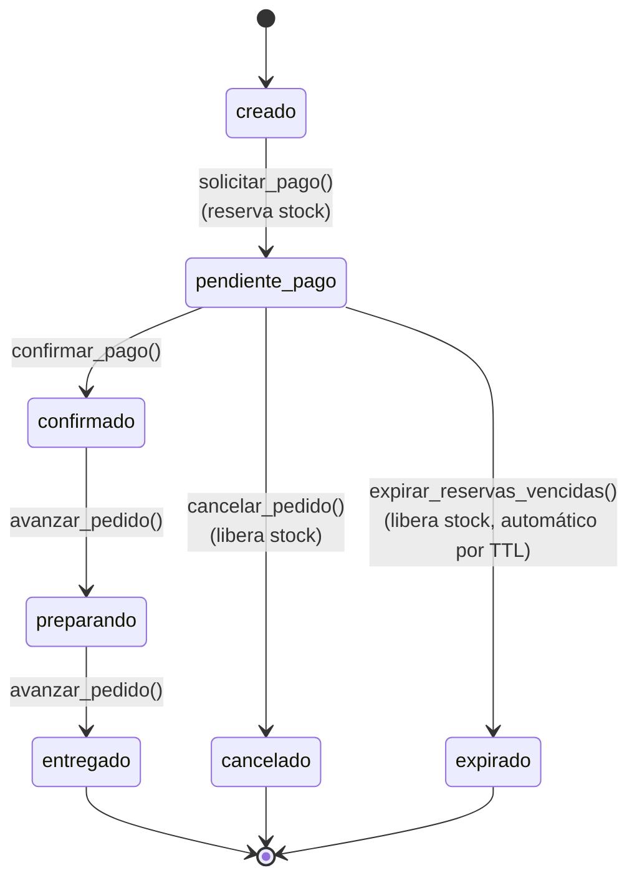

# 03-05 · Máquina de Estados del Pedido

| Metadato | Valor |
|---|---|
| Documento | FSM del módulo Pedidos (v1 restaurantes) |
| Estado | **En revisión** |
| Versión | 0.1.0 |
| Última actualización | 2026-07-03 |
| Responsable | CTO |
| Depende de | `03-03` (entidades del núcleo y catálogo), `ADR-006` (reserva de stock) |
| Es dependencia de | `03-06`, `03-07`, la tarea T4.1 del plan de entrega |

---

## 1. Alcance y principio rector

Este documento es **el contrato** de la FSM del pedido — se redacta antes de codificar T4.1, no después (`PLAN-DE-ACCION-claude-code.md` §Fase 4). "Pedidos" es un **módulo**, no parte del núcleo: nada de `identidad/tenancy`, `catálogo`, `pagos`, `notificaciones` o `panel` (core) puede importar de `pedidos` (`01-01` §5, `CLAUDE.md` regla #8). El módulo sí puede depender del core (lee `productos` del catálogo, usa `tenants`/RLS de tenancy) — la dependencia es de una sola vía.

Alcance v1: flujo para-llevar/domicilio (`cliente → pedido → pago → preparar → entregar/recoger`), sin servicio en mesa (`01-01` §6.2). No hay pasarela de pago real todavía (Fase 5) — la confirmación de pago se simula mediante una función invocada manualmente; el walking skeleton prueba la FSM y la concurrencia del stock, no la integración con Wompi.

## 2. Estados

| Estado | Significado |
|---|---|
| `creado` | El pedido existe con sus ítems, pero el stock aún no está reservado. |
| `pendiente_pago` | Stock reservado (decrementado atómicamente); esperando confirmación de pago o expiración. |
| `confirmado` | Pago confirmado; la reserva de stock queda permanente (no hay decremento adicional). |
| `preparando` | El negocio empezó a preparar el pedido. |
| `entregado` | Entregado o recogido por el cliente. Estado terminal. |
| `cancelado` | Cancelado antes de confirmar el pago (manual). Stock liberado. Estado terminal. |
| `expirado` | La reserva venció sin pago confirmado. Stock liberado automáticamente. Estado terminal. |

## 3. Transiciones válidas



Cualquier transición no listada arriba (incluida cualquier transición *desde* un estado terminal) es **inválida** y debe rechazarse con una excepción — no silenciosamente. Ejemplos de transiciones inválidas que T4.1 debe probar explícitamente (LOOP A):

- `creado → confirmado` (saltarse la reserva de stock).
- `creado → preparando`, `creado → entregado` (saltarse pago y reserva).
- `entregado → cualquier otro estado` (reabrir un pedido terminado).
- `expirado → confirmado` o `cancelado → confirmado` (revivir un pedido muerto).
- `confirmado → cancelado` (cancelar después de pagar no es parte de v1 — ver §7 no-objetivos; hoy simplemente no existe esa transición).

## 4. Reserva y liberación de stock (`ADR-006`)

**La reserva ES el decremento atómico**, no dos operaciones separadas. Al transicionar `creado → pendiente_pago`:

```sql
update public.productos
set stock = stock - <cantidad>
where id = <producto_id> and tenant_id = <tenant_id> and stock >= <cantidad>;
-- rowcount 0 => stock insuficiente, la transicion completa se aborta (rollback)
```

Esto es exactamente lo que hace segura la concurrencia: N solicitudes simultáneas sobre `stock = 1` compiten por la misma fila; Postgres serializa los `UPDATE`s sobre esa fila, y solo una consigue `stock >= cantidad` en el momento de ejecutarse — las demás ven `rowcount = 0` y fallan limpio, sin necesidad de locking explícito adicional.

Confirmar el pago (`pendiente_pago → confirmado`) **no vuelve a tocar `stock`** — la reserva ya fue el descuento real; confirmar solo cierra el ciclo de la reserva (marca `stock_reservations.liberada = false` como definitivo, ya no liberable).

Cancelar o expirar (`pendiente_pago → cancelado | expirado`) **libera** la reserva con el incremento inverso:

```sql
update public.productos
set stock = stock + <cantidad>
where id = <producto_id> and tenant_id = <tenant_id>;
```

## 5. Expiración de reservas

`orders.reserva_expira_at` se fija al transicionar a `pendiente_pago` (`now() + TTL`; TTL configurable, corto en tests). Una función `expirar_reservas_vencidas()` — análoga a `process_pending_jobs()` de T2.2 — recorre los pedidos en `pendiente_pago` con `reserva_expira_at < now()`, libera su stock y los mueve a `expirado`.

**Nota de alcance (igual que T2.2):** en el walking skeleton esta función se invoca manualmente (tests, o una llamada directa). Un disparador automático (`pg_cron` u otro *scheduler*) es una decisión operativa que se toma cuando el volumen real de pedidos lo exija, no aquí — la costura ya existe (la función es autocontenida e idempotente: correrla dos veces sobre el mismo pedido ya expirado no libera stock dos veces, porque el segundo intento ya no encuentra el pedido en `pendiente_pago`).

## 6. Roles

A diferencia del catálogo (solo `admin` escribe), **cualquier miembro del tenant** (`admin` o `staff`) puede crear y operar pedidos — es el trabajo del día a día de `staff` (`03-02` §7). No hay restricción de rol adicional en v1 sobre quién dispara cada transición.

## 7. No-objetivos de esta versión

- Sin integración real de pasarela (Fase 5); `confirmar_pago()` se invoca manualmente en el walking skeleton, no desde un webhook real todavía.
- Sin estado `rechazado` explícito: cuando la pasarela real entre en Fase 5, un pago rechazado por la pasarela probablemente mapea a una transición `pendiente_pago → cancelado` o a un estado nuevo — se decide en `03-07`, no aquí.
- Sin cancelación después de confirmado (reembolsos) — eso depende de la pasarela real, Fase 5.
- Sin servicio en mesa/comandas (`01-01` §6.2).
- Sin disparador automático de `expirar_reservas_vencidas()` (ver §5) — se activa cuando haga falta operacionalmente.
- Sin modificadores/variantes por ítem del pedido — un `order_item` es simplemente `producto_id` + `cantidad`.

## 8. Pruebas requeridas (T4.1)

1. **LOOP A — transiciones:** tabla de pares (estado origen, estado destino) válidos e inválidos de §3, como pgTAP; cada transición inválida debe lanzar excepción sin modificar la fila.
2. **LOOP B — concurrencia:** N solicitudes simultáneas de `solicitar_pago()` sobre un producto con `stock = 1` ⇒ exactamente 1 exitosa, N-1 fallan limpio con "stock insuficiente", el `stock` final es exactamente `0` (nunca negativo). Correr repetidamente (20 veces) para confirmar que es determinístico, no una condición de carrera oculta.
3. **LOOP C — expiración:** un pedido con `reserva_expira_at` en el pasado ⇒ `expirar_reservas_vencidas()` lo mueve a `expirado` y el `stock` del producto vuelve a su valor original.
4. Aislamiento multi-tenant estándar (FF-1) extendido a `orders`, `order_items`, `stock_reservations`.
5. Cada transición registra una fila en `event_log` con el `correlation_id` del pedido (`03-03` §2.4).

## 9. Decisiones y documentos relacionados

- `03-11/ADR-006` — Reserva de stock en la solicitud de pago.
- `03-03` §5.3 (a añadir en el mismo PR de T4.1) — esquema real de `orders`, `order_items`, `stock_reservations`.
- `01-01` §9 — flujo operativo de v1 que esta FSM implementa.
- `03-02` §5.6 — patrón de funciones `security definer` que reutilizan `solicitar_pago()`/`expirar_reservas_vencidas()` para operar sobre filas de otros tenants dentro del mismo tenant (no aplica cross-tenant, todo queda filtrado por `tenant_id`).

---

*Documento en revisión. Pendiente: lectura y aprobación del owner antes de pasar a Vigente.*
