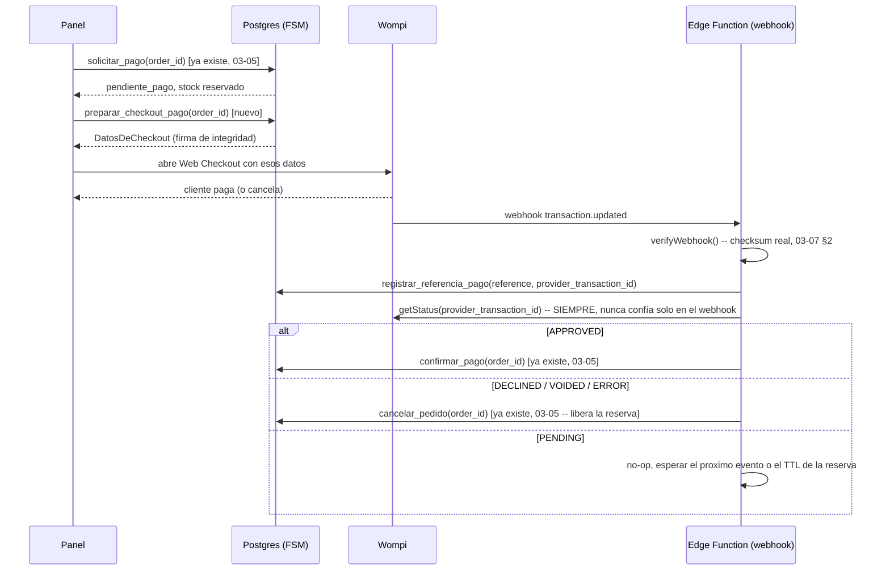

# 03-07 · Capa de Pagos Multi-Pasarela

| Metadato | Valor |
|---|---|
| Documento | Capa de pagos — puerto `PaymentGateway` + adaptador Wompi (D-7) |
| Estado | **En revisión** |
| Versión | 0.1.0 |
| Última actualización | 2026-07-04 |
| Responsable | CTO |
| Depende de | `ADR-003` (multi-pasarela sin agregador), `D-7` (Wompi), `03-05` (FSM del pedido), `03-03` (núcleo) |
| Es dependencia de | `03-06` (contrato de webhooks), `04-04` (cumplimiento de pagos), la tarea T5.1 del plan de entrega |

---

## 1. Alcance y principio rector

Este documento es **el contrato** de T5.1, redactado antes de codificar (mismo principio que `03-05` para la FSM). Implementa `ADR-003` (abstracción multi-pasarela, la plataforma nunca custodia dinero) con **Wompi** como primer adaptador (D-7, verificado funcional el 2026-07-03). El puerto `PaymentGateway` es agnóstico a Wompi — agregar Nequi directa u otra pasarela después implica un adaptador nuevo, no tocar el núcleo ni la FSM de pedidos.

**Regla no negociable (`CLAUDE.md` regla #5): el webhook nunca confirma un pago por sí solo.** Todo evento de pago dispara una consulta a `getStatus` contra la pasarela antes de transicionar un pedido a `confirmado`. Un webhook falsificado, duplicado o corrupto no puede, por sí mismo, mover dinero ni stock.

## 2. Cómo funciona realmente el checkout de Wompi (verificado contra el sandbox real)

A diferencia de una API que "crea la transacción" del lado del servidor, Wompi usa un **Web Checkout** que el navegador del cliente abre directamente: el backend solo prepara los datos (referencia, monto, firma de integridad) y el widget/redirect de Wompi es quien crea la transacción real cuando el cliente completa el pago.

**Firma de integridad** (verificado con una transacción real de sandbox): `SHA256(referencia + monto_en_centavos + moneda + secreto_de_integridad)`, hex. Se calcula **server-side** (el secreto nunca llega al cliente).

**Nuestra referencia = `order.id`.** Wompi exige una referencia única por transacción; reutilizamos el UUID del pedido directamente — no hace falta una columna nueva ni generar otro identificador. Si un pedido expira o se cancela, no se reintenta con la misma referencia: se crea un pedido nuevo (consistente con `03-05`, sin retries dentro del mismo pedido).

**Verificado con dos transacciones reales de sandbox** (fixtures en `supabase/tests/fixtures/`, capturadas el 2026-07-04):
- `wompi-transaction-approved.json` / `wompi-event-approved.json` — tarjeta de prueba `4242...4242`, resultado `APPROVED`.
- `wompi-transaction-declined.json` / `wompi-event-declined.json` — tarjeta de prueba `4111...1111`, resultado `DECLINED`.

## 3. El puerto `PaymentGateway` (`packages/core`)

```ts
export type EstadoPago = "pending" | "approved" | "declined" | "error";

export interface SolicitudDePago {
  reference: string;       // = order.id
  amountInCents: number;
  currency: "COP";
  customerEmail: string;
}

export interface DatosDeCheckout {
  publicKey: string;
  reference: string;
  amountInCents: number;
  currency: string;
  signature: string;       // firma de integridad, calculada server-side
  redirectUrl: string;
}

export interface EstadoDeTransaccion {
  providerTransactionId: string;
  reference: string;
  status: EstadoPago;
  amountInCents: number;
}

export interface EventoDeWebhook {
  providerTransactionId: string;
  reference: string;
  status: EstadoPago;
  raw: unknown;
}

export interface PaymentGateway {
  createPaymentRequest(input: SolicitudDePago): Promise<DatosDeCheckout>;
  getStatus(providerTransactionId: string): Promise<EstadoDeTransaccion>;
  verifyWebhook(rawBody: string, headers: Record<string, string>): boolean;
  parseEvent(rawBody: string): EventoDeWebhook;
}
```

`createPaymentRequest` **no llama a la API de Wompi** — solo calcula la firma de integridad y arma los datos que el panel usa para abrir el Web Checkout. La transacción real la crea Wompi cuando el cliente paga.

## 4. Credenciales por tenant, cifradas (`CLAUDE.md` regla #9)

Verificado contra el stack local: la extensión `supabase_vault` (`vault.create_secret()`, vista `vault.decrypted_secrets`) está disponible. Diseño:

```sql
create table public.payment_credentials (
  id                    uuid primary key default gen_random_uuid(),
  tenant_id             uuid not null references public.tenants(id) on delete cascade,
  provider              text not null default 'wompi' check (provider in ('wompi')),
  public_key            text not null,                -- no es secreta, se usa client-side
  private_key_secret_id uuid not null,                 -- referencia a vault.secrets
  events_secret_id      uuid not null,
  integrity_secret_id   uuid not null,
  created_at            timestamptz not null default now(),
  unique (tenant_id, provider)
);
```

Solo `public_key` vive en texto plano (por diseño: Wompi la expone al navegador del cliente en cada checkout, no es un secreto). Las otras tres van cifradas en `vault.secrets`; `payment_credentials` solo guarda el `uuid` que las referencia, nunca el valor. Una función `security definer` (`get_payment_credentials(tenant_id)`) las descifra bajo demanda — **`EXECUTE` revocado a `public`/`anon`/`authenticated`** (03-02 §5.7): solo la Edge Function de pagos (`service_role`) puede invocarla. Sin policy de `select`/`insert` para `authenticated` en `payment_credentials` tampoco — el alta de credenciales de un tenant es un flujo de onboarding (`05-02`, futuro), no algo que el cliente toque directo.

## 5. Flujo completo (extiende la FSM de `03-05`, no la reemplaza)



**Decisión de diseño (resuelve el no-objetivo abierto en `03-05` §7):** Wompi no tiene un estado `rechazado` distinto de `cancelado` en v1 — un pago `DECLINED`/`VOIDED`/`ERROR` mapea a la transición existente `pendiente_pago → cancelado` (ya libera stock y ya está probada). Un estado `rechazado` separado, si el negocio lo necesita para reportes, es una migración futura — no bloquea T5.1.

`orders` gana una columna nueva: `provider_transaction_id text` (nullable), poblada por `registrar_referencia_pago()` en cuanto llega el primer webhook — es lo que la conciliación (§6) usa para volver a preguntarle a Wompi.

## 6. Job de conciliación

Pedidos en `pendiente_pago` con más de X minutos (configurable, corto en tests):
- **Si tienen `provider_transaction_id`** (el webhook llegó pero algo falló después, p. ej. un timeout de red hacia Wompi): se vuelve a llamar `getStatus` y se resuelve (confirmar o cancelar) igual que el webhook.
- **Si NO tienen `provider_transaction_id`** (el webhook nunca llegó): no hay nada que re-consultar todavía — se registra una alerta en `event_log` (`event_type = 'order.conciliacion.alerta'`) para revisión humana. No se confunde con la expiración de `03-05` (que libera la reserva por TTL); la conciliación es un chequeo adicional para detectar webhooks perdidos **antes** de que la reserva expire sola.

## 7. Verificación de webhook (`verifyWebhook`, `parseEvent`)

Algoritmo real (verificado contra la documentación de Wompi + una firma calculada a mano sobre datos reales, `supabase/tests/fixtures/wompi-event-approved.json`):

```
checksum = SHA256(
  concat(valores de data.transaction en el orden de signature.properties)
  + timestamp (entero, como string)
  + events_secret
)
```

Comparación en tiempo constante (mismo patrón que `webhook-echo`, `03-02`/T2.2). Firma inválida ⇒ 401, nada se persiste — igual que el patrón webhook-rápido ya establecido.

## 8. No-objetivos de esta versión

- Sin estado `rechazado` explícito (§5, decisión tomada: mapea a `cancelado`).
- Sin disparador automático del job de conciliación (mismo criterio que `expirar_reservas_vencidas`, `03-05` §5) — se invoca manualmente/por test hasta que el volumen real lo exija.
- Sin UI de onboarding para que un tenant cargue sus propias credenciales de Wompi (`05-02`, futuro) — en el walking skeleton las credenciales del tenant de demo se insertan directamente vía `service_role`.
- Sin soporte de otros métodos de pago de Wompi más allá de tarjeta (Nequi, PSE, Bancolombia) en el adaptador — el puerto los admite a futuro sin cambiar la interfaz.
- Sin facturación DIAN ni cumplimiento tributario (`04-04`, no bloquea el walking skeleton).

## 9. Decisiones y documentos relacionados

- `ADR-003` — multi-pasarela sin agregador.
- `D-7` (`00-INDEX` §7) — Wompi gana el spike de sandbox.
- `03-05` §7 — no-objetivo que este documento resuelve (mapeo de rechazo).
- `03-02` §5.6/§5.7/§5.8 — patrones de `security definer`, revocación de `EXECUTE`, y bypass de `service_role` para funciones tenant-scoped, todos reutilizados aquí.

## 10. Verificación real (no solo diseño)

Todo lo descrito arriba se implementó y se probó contra servicios reales, no mocks:

- **Checksum de webhook** (§7): 6 contract tests contra los 2 pares de fixtures reales (`supabase/tests/fixtures/wompi-event-{approved,declined}.json`), incluida manipulación de payload y secreto incorrecto.
- **`getStatus`** (§3): probado contra la API real de sandbox, reconsultando las mismas transacciones reales de las fixtures.
- **Credenciales cifradas** (§4): `set_payment_credentials()` (primitiva real de alta, reutilizable por `05-02`) cifra las 3 secretas reales de Wompi vía `vault.create_secret()`; `preparar_checkout_pago()` calcula la firma de integridad dentro de Postgres y el resultado coincide con el algoritmo documentado.
- **GATE de Fase 5 completo, dos veces** (`supabase/functions/wompi-webhook/integration.test.ts`): pedido real → `solicitar_pago` (reserva) → transacción real de Wompi (tarjeta de prueba) → webhook real con checksum real → `getStatus` real antes de decidir → pedido confirmado/cancelado + inventario correcto, para el camino aprobado y el rechazado. Replay del mismo evento confirmado como idempotente (FF-4).
- **Job de conciliación** (§6): probado en sus dos ramas — resuelve un pedido con `provider_transaction_id` re-consultando la API real, y genera una alerta en `event_log` cuando no hay nada que re-consultar.
- **Hallazgo no anticipado en el diseño original**, corregido en la misma tarea: `solicitar_pago`/`confirmar_pago`/`cancelar_pedido`/`avanzar_pedido` (T4.1) no podían invocarse desde el webhook (`service_role` sin `current_tenant_id()`) — resuelto con el patrón de `03-02` §5.8.

---

*Documento en revisión. Pendiente: lectura y aprobación del owner antes de pasar a Vigente.*
