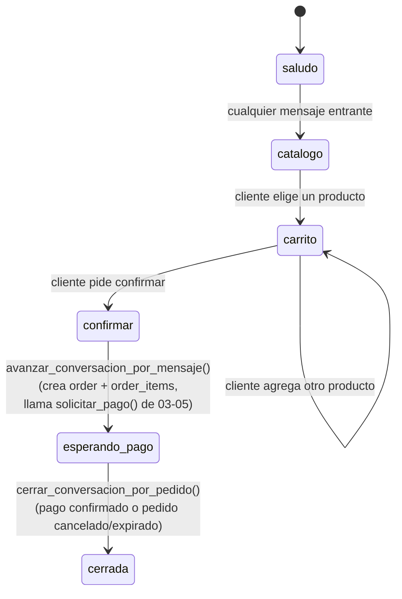

# 03-08 · Integración WhatsApp

| Metadato | Valor |
|---|---|
| Documento | Webhook de Meta + FSM conversacional mínima (módulo Notificaciones/WhatsApp) |
| Estado | **En revisión** |
| Versión | 0.1.0 |
| Última actualización | 2026-07-04 |
| Responsable | CTO |
| Depende de | `ADR-001` (Meta Cloud API directo), `03-05` (FSM del pedido), `03-03` §5.1 (`jobs`), `03-02` (RLS, `es_llamada_de_servicio()`) |
| Es dependencia de | la tarea T6.1 del plan de entrega |

---

## 0. Estado de esta versión (importante)

Este documento se redacta **sin WABA de plataforma disponible todavía** (D-3/T0.5 sigue en curso — ver `00-INDEX` §7). Cubre y deja implementado/probado con simulación todo lo que **no** depende de credenciales reales de Meta:

- Contrato del webhook (verify-token, firma, idempotencia).
- Esquema de estado de conversación.
- FSM conversacional mínima.
- Puerto de envío de mensajes (`WhatsAppSender`) con adaptador simulado.

Queda explícitamente **fuera** de esta versión (bloqueado por T0.5, no por diseño): conectar el adaptador real de Meta Cloud API, probar contra el número de test de la WABA de plataforma, aprobar plantillas en Meta, y el video del GATE de Fase 6 (`PLAN-DE-ACCION-claude-code.md` §Fase 6). Cuando el owner tenga el WABA, se añade el adaptador real (mismo puerto, sin tocar la FSM) y se corre el EXIT completo de T6.1.

## 1. Alcance y principio rector

Mismo principio que `03-05`/`03-07`: contrato antes de código. **WhatsApp/Notificaciones es un módulo del core** (`CLAUDE.md` regla #8, `01-04` glosario "Business OS"): no importa nada de `pedidos`. La relación es la inversa de lo que podría parecer intuitivo — es la conversación de WhatsApp la que **dispara** operaciones del módulo Pedidos, nunca al revés, y lo hace de la misma forma que ya lo hace el webhook de pagos (`03-07`): invocando las funciones `security definer` de la FSM (`solicitar_pago()`, `confirmar_pago()`, etc., `03-05`) vía `service_role` + `es_llamada_de_servicio()` (`03-02` §5.8). No hay import de paquete ni de código entre módulos — el límite se respeta porque la única superficie compartida es el contrato SQL `security definer` que `pedidos` ya expone, el mismo que usa `pagos`.

Alcance v1: flujo mínimo `saludo → catálogo → carrito → confirmar → link de pago → notificación de estado`, para-llevar/domicilio, un número de WhatsApp por tenant (`01-01` §6.2 — sin multi-agente ni chat en vivo con humano).

## 2. El webhook de Meta

Dos verbos, un solo endpoint (`whatsapp-webhook`), igual que el patrón de Meta Cloud API:

### 2.1 `GET` — verificación del endpoint

Meta llama `GET` una sola vez al configurar el webhook, con `hub.mode=subscribe`, `hub.verify_token` y `hub.challenge` en query string. Se compara `hub.verify_token` contra un secreto por variable de entorno (`WHATSAPP_VERIFY_TOKEN`, no por tenant — es de la app de Meta, no del negocio) en tiempo constante; si coincide, se responde `200` con el valor exacto de `hub.challenge` como cuerpo. Si no coincide, `403`.

### 2.2 `POST` — recepción de mensajes/eventos

Igual patrón que `webhook-echo` (T2.2) y `wompi-webhook` (T5.1) — **webhook-rápido** (`CLAUDE.md` regla #5):

1. Validar firma `X-Hub-Signature-256` (HMAC-SHA256 del `app secret` sobre el rawBody, prefijo `sha256=`) en tiempo constante. Inválida ⇒ `401`, nada se persiste.
2. Parsear el payload de Meta (estructura `entry[].changes[].value.messages[]` — un `POST` puede traer 0 o varios mensajes, y también eventos de `statuses` que no son mensajes entrantes; estos últimos se registran en `event_log` pero no avanzan la FSM).
3. Resolver `tenant_id` a partir del `phone_number_id` del payload (`whatsapp_numbers`, §4) — un webhook no tiene JWT de usuario, así que el tenant se deriva del número de WhatsApp que recibió el mensaje, no de un claim.
4. Persistir la recepción con clave de idempotencia = `messages[].id` (el `message_id` que asigna Meta) en `jobs` (`03-03` §5.1, reutilizada tal cual — la tabla ya está pensada para esto: *"la usan Pedidos/Pagos... y WhatsApp (Fase 6) por igual"*), vía `upsert` con `unique (tenant_id, idempotency_key)` e `ignoreDuplicates`. Si la fila ya existía (replay de Meta), no se procesa una segunda vez.
5. Avanzar la FSM conversacional (§5) llamando a `avanzar_conversacion_por_mensaje()` (§6) — una RPC de Postgres, no una llamada saliente a la Cloud API. **Decisión de implementación (ajusta el diseño original de este documento a lo que realmente se construyó, igual que `03-07` §5 ajustó `03-05`):** a diferencia del `jobs`-como-cola-diferida imaginado originalmente, el procesamiento ocurre síncrono dentro del mismo `POST`, igual que `wompi-webhook` (`03-07` §5) — es seguro porque lo único "lento" en la ruta es una RPC a la propia base, no una llamada de red a un tercero; el paso 4 ya provee la idempotencia real (FF-4), no la separación síncrono/asíncrono. Responder `200` rápido sigue cumpliéndose.

Meta reintenta el `POST` si no recibe `200` a tiempo, o si el número de reintentos de entrega no se agota — por eso la idempotencia por `message_id` (§7.1 abajo, FF-4) no es opcional.

**Gramática de comandos del cliente (v1, laboratorio):** el texto libre del cliente se interpreta con reglas mínimas, no NLU: cualquier mensaje en `saludo` avanza a `catalogo`; `agregar <producto_id> <cantidad>` selecciona un ítem (en `catalogo` o `carrito`); `confirmar` (en `carrito`, con carrito no vacío) avanza a `confirmar`; `si` (en `confirmar`) crea el pedido. Cualquier otro texto es un no-op con un mensaje de ayuda — nunca una excepción (a diferencia de la FSM de pedidos, aquí quien "emite" es un cliente humano escribiendo texto libre, no puede fallar duro por un mensaje inesperado). Reemplazar esta gramática por selección con botones/listas interactivas de Meta es una mejora de UX diferida, no bloquea T6.1.

## 3. Estado de conversación en Postgres (nunca en memoria)

```sql
create table public.whatsapp_conversations (
  id              uuid primary key default gen_random_uuid(),
  tenant_id       uuid not null references public.tenants(id) on delete cascade,
  customer_phone  text not null,
  state           text not null default 'saludo'
                  check (state in ('saludo', 'catalogo', 'carrito', 'confirmar', 'esperando_pago', 'cerrada')),
  cart            jsonb not null default '[]'::jsonb,
  order_id        uuid references public.orders(id),
  updated_at      timestamptz not null default now(),
  unique (tenant_id, customer_phone)
);

create index on public.whatsapp_conversations (tenant_id);
```

Una fila por conversación activa (tenant + número del cliente). `order_id` se llena cuando la conversación produce un pedido real (§5, transición `confirmar → esperando_pago`) — enlaza la conversación con la FSM de `03-05` sin que ninguna de las dos tablas dependa de la otra a nivel de módulo (es una referencia de datos, no un import de código). `cart` es el carrito en construcción antes de convertirse en `order_items` reales; vive como `jsonb` porque es estado transitorio de la conversación, no una entidad de negocio (a diferencia de `order_items`, que sí lo es).

**RLS** (mismo patrón que `event_log`/`jobs`, `03-03` §2.4/§5.1): solo lectura para miembros del tenant (el panel puede mostrar conversaciones activas como visibilidad operativa); el `insert`/`update` real lo hace el handler del webhook con `service_role`, nunca el cliente:

```sql
alter table public.whatsapp_conversations enable row level security;

create policy "miembros leen conversaciones de su tenant"
  on public.whatsapp_conversations for select
  using (tenant_id = public.current_tenant_id());
```

Sin policy de `insert`/`update`/`delete` para `authenticated` — igual criterio que `orders` (`03-03` §5.3): todo cambio de estado pasa por una función `security definer` (§5), nunca por un `UPDATE` directo del cliente ni del handler sin pasar por la función.

### 3.1 `whatsapp_numbers` (identidad del canal por tenant)

```sql
create table public.whatsapp_numbers (
  id                uuid primary key default gen_random_uuid(),
  tenant_id         uuid not null references public.tenants(id) on delete cascade,
  phone_number_id   text not null unique,  -- el que Meta manda en el payload del webhook
  access_token_secret_id uuid not null,    -- referencia a vault.secrets, igual patron que 03-07 §4
  created_at        timestamptz not null default now(),
  unique (tenant_id)
);
```

Mismo patrón de credenciales cifradas que `payment_credentials` (`03-07` §4): el token de acceso de Meta Cloud API por tenant vive cifrado en `vault.secrets`; esta tabla solo guarda la referencia. `phone_number_id` es lo único en texto plano — es un identificador público de Meta, no un secreto, y es la clave que el webhook usa para resolver `tenant_id` (§2.2 punto 3). Una función `security definer` (`get_whatsapp_credentials(tenant_id)`) descifra el token bajo demanda, `EXECUTE` revocado a `public`/`anon`/`authenticated` (`03-02` §5.7) — solo la Edge Function de WhatsApp (`service_role`) la invoca.

## 4. El puerto `WhatsAppSender` (`packages/core`)

Mismo principio que `PaymentGateway` (`03-07` §3): sin imports, tipo compartido entre `apps/panel` y `supabase/functions` vía ruta relativa.

```ts
export interface OutgoingMessage {
  to: string;              // customer_phone en formato E.164
  body: string;
}

export interface WhatsAppCredentials {
  phoneNumberId: string;
  accessToken: string;
}

export interface SendResult {
  providerMessageId: string;
}

export interface WhatsAppSender {
  sendMessage(msg: OutgoingMessage, credentials: WhatsAppCredentials): Promise<SendResult>;
  verifyWebhookSignature(rawBody: string, signature: string | null, appSecret: string): Promise<boolean>;
  parseIncoming(rawBody: string): IncomingMessage[];
}

export interface IncomingMessage {
  providerMessageId: string;  // messages[].id de Meta -- clave de idempotencia
  phoneNumberId: string;      // para resolver tenant_id
  from: string;               // customer_phone
  text: string;
}
```

**Adaptador simulado** (`SimulatedWhatsAppSender`, en `supabase/functions/_shared/`, usado por todos los tests de esta fase): `sendMessage` registra el mensaje saliente en memoria/tabla de test en vez de llamar a la Graph API real; `parseIncoming` decodifica fixtures con la forma real del payload de Meta (capturada de la documentación pública de Graph API, no de un envío real — a diferencia de los fixtures de Wompi en `03-07`, que sí son de sandbox real, estos son sintéticos hasta que haya WABA). El adaptador real (`MetaCloudApiSender`) se implementa cuando el owner tenga las credenciales — mismo puerto, sin tocar la FSM ni el webhook.

## 5. FSM conversacional mínima



Transición `confirmar → esperando_pago` es el punto de integración con `pedidos`: crea un `order` real (con sus `order_items` desde `cart`) y llama `solicitar_pago()` (`03-05` §3) exactamente como lo haría el panel — la conversación de WhatsApp es otro *cliente* de la FSM de pedidos, no una FSM paralela que la reimplementa. El link de pago que se le manda al cliente por WhatsApp es el mismo `preparar_checkout_pago()` (`03-07` §5) que usa el panel.

**Notificaciones de estado** (`esperando_pago → cerrada`): cuando `confirmar_pago()`/`cancelar_pedido()`/`expirar_reservas_vencidas()` (`03-05`) transicionan el `order` enlazado a una conversación, corresponde enviar un mensaje saliente. `cerrar_conversacion_por_pedido()` (§6) es la primitiva que hace la transición de conversación y devuelve `(customer_phone, respuesta)` — es una **reacción a `event_log`**, no un import de `pedidos` (lee su `event_log` ya existente, `03-03` §2.4). **Nota de alcance de esta versión**: el *disparador* automático (un proceso que recorra `event_log` por los `order_type` de transición y llame esta función + `WhatsAppSender.sendMessage`) no está implementado todavía — se invoca manualmente/por test, mismo criterio que `expirar_reservas_vencidas` (`03-05` §5) y `process_pending_jobs` (`03-03` §5.1): la costura ya existe y está probada, el disparador automático es una decisión operativa que se toma cuando haya WABA real para enviar el mensaje resultante.

**Plantillas fuera de la ventana de 24h**: Meta exige plantillas pre-aprobadas para mensajes salientes fuera de la ventana de 24h desde el último mensaje del cliente. En v1, todo el flujo saludo→confirmar ocurre dentro de esa ventana (el cliente inició la conversación); solo la notificación de confirmación de pago puede caer fuera de ventana si el cliente tarda. **No-objetivo de esta versión**: el envío de plantillas pre-aprobadas es parte del adaptador real (`MetaCloudApiSender`), no de la FSM — la FSM solo decide *qué* mensaje mandar, el adaptador decide *cómo* (texto libre vs. plantilla) según la ventana.

## 6. Funciones `security definer`: `avanzar_conversacion_por_mensaje()` y `cerrar_conversacion_por_pedido()`

Patrón idéntico a `03-05`/`03-07`: dos funciones (no una sola, ajuste de nombres sobre el diseño original de este documento) que validan la transición, operan sobre `whatsapp_conversations` y, cuando corresponde, invocan las funciones de `pedidos`:

- **`avanzar_conversacion_por_mensaje(tenant_id, customer_phone, mensaje, producto_id?, cantidad?)`** — el dispatcher de mensajes entrantes (§2.2 paso 5). En la transición `confirmar → esperando_pago` crea el `order`/`order_items` reales desde el `cart` y llama `solicitar_pago()` (`03-05` §3) — la conversación es otro cliente de la FSM de pedidos, no una reimplementación. Se invoca desde el handler del webhook (`service_role`, sin sesión de usuario) — reutiliza `es_llamada_de_servicio()` (`03-02` §5.8), igual que `solicitar_pago()` ya lo hace para el webhook de pagos. `EXECUTE` otorgado a `authenticated` (paridad con el resto de funciones de dominio) y `service_role`.
- **`cerrar_conversacion_por_pedido(order_id, evento)`** — la reacción a `event_log` (§5, "notificaciones de estado"): la invoca el job de notificación cuando `confirmar_pago()`/`cancelar_pedido()`/`expirar_reservas_vencidas()` transicionan el pedido enlazado a una conversación. Cross-tenant por diseño (no filtra por `current_tenant_id()`, igual que `expirar_reservas_vencidas`, `03-02` §5.7) — no hay "tenant actual" en contexto de job de servicio. `EXECUTE` revocado a `public`/`anon`/`authenticated`, solo `service_role`.

Ambas están respaldadas por un trigger (`validar_transicion_conversacion`) que rechaza cualquier `UPDATE` que no siga las transiciones válidas de §5, mismo principio de defensa en profundidad que `validar_transicion_pedido` (`03-05` §3).

## 7. Pruebas requeridas (T6.1)

### 7.1 Idempotencia (FF-4)

Mismo test que `webhook-echo`/`wompi-webhook` (replay ×2 del mismo `message_id` de Meta ⇒ un solo efecto): Meta reenvía mensajes si no confirma la entrega a tiempo; un `message_id` duplicado no debe avanzar la FSM dos veces ni mandar el mensaje de bienvenida dos veces.

### 7.2 FSM conversacional con mensajes simulados

Tabla de transiciones válidas/inválidas de §5 (igual que LOOP A de `03-05`), usando fixtures de payloads de Meta (formato real de Graph API, contenido sintético — §4) en vez de mensajes reales, dado que no hay WABA todavía.

### 7.3 Aislamiento (FF-1)

`whatsapp_conversations` y `whatsapp_numbers` extienden el estándar de `03-02` §8: tenant A no lee/escribe conversaciones o números de B.

### 7.4 Fuera de alcance de esta sesión (bloqueado por T0.5)

- Prueba contra el número de test de la WABA de plataforma real.
- Envío real vía Graph API (el adaptador real no se implementa hasta tener credenciales).
- Aprobación de plantillas en Meta.
- Video del GATE de Fase 6 (ciclo completo desde un teléfono real).

## 8. No-objetivos de esta versión

- Sin multi-agente ni traspaso a humano dentro de la conversación (`01-01` §6.2).
- Sin soporte de medios (imágenes, audio, ubicación) en el mensaje entrante — solo texto en v1; el catálogo se navega por texto/botones simples, no por catálogo nativo de WhatsApp (Meta Commerce) — eso es una integración distinta, no planeada para v1.
- Sin reintentos configurables de envío saliente más allá de lo que la cola de `jobs` ya provee (reintento = volver a encolar, no hay backoff especial todavía).
- Sin el adaptador real de Meta Cloud API (§0) — costura lista, implementación diferida a cuando exista WABA.
- Sin monitoreo de *quality rating* del número (`CLAUDE.md` regla de guardrails de T6.1) — se diseña junto con `05-04` (observabilidad), no bloquea el walking skeleton en simulación.

## 9. Decisiones y documentos relacionados

- `ADR-001` — Meta Cloud API directo (candidato a supersede vía D-3 si el onboarding manual escala mal).
- `03-05` — FSM del pedido; `confirmar → esperando_pago` es un cliente más de sus funciones.
- `03-07` §4 — patrón de credenciales cifradas por tenant (Vault), reutilizado para `whatsapp_numbers`.
- `03-03` §5.1 — tabla `jobs`, explícitamente pensada para Pagos y WhatsApp por igual.
- `03-02` §5.6/§5.7/§5.8 — patrones de `security definer`, revocación de `EXECUTE`, bypass de `service_role`.
- `01-04` glosario — entradas "Meta Cloud API", "WABA", "FSM", "Idempotencia".

## 10. Verificación real (lo implementable sin WABA)

Todo lo descrito arriba se implementó y se probó contra el stack local real de Supabase, sin mocks de base de datos (solo la Graph API de Meta está simulada, por no haber WABA — §0):

- **Aislamiento (FF-1)**: `whatsapp_numbers` (deny-by-default total para `authenticated`, igual que `payment_credentials`) y `whatsapp_conversations` (miembros solo ven las de su tenant; sin membership, cero filas) — `supabase/tests/0013_whatsapp_isolation.sql`, 5 casos, verde.
- **Flujo conversacional completo** (`supabase/functions/whatsapp-webhook/integration.test.ts`): mensaje real de "hola" → `catalogo` → `agregar <producto_id> <cantidad>` → `carrito` (con el carrito correcto) → `confirmar` → `confirmar` (estado) → `si` → pedido real creado, `solicitar_pago()` disparado, stock reservado (mismo mecanismo atómico de `03-05` §4), total calculado correctamente.
- **Notificación de cierre**: `confirmar_pago()` + `cerrar_conversacion_por_pedido()` mueven la conversación a `cerrada` y devuelven el mensaje correcto para el cliente.
- **Idempotencia (FF-4)**: mismo `message_id` de Meta enviado dos veces ⇒ un solo job persistido, un solo avance de estado — replay confirmado inocuo.
- **Firma inválida** ⇒ `401`, nada se persiste (verificado con firma incorrecta contra el algoritmo real `HMAC-SHA256`/`X-Hub-Signature-256`).
- Suite completa (`pnpm lint && pnpm typecheck && pnpm test`, `supabase test db`, `deno test` de Edge Functions) verde con estos cambios — sin regresiones en Fases 2-5.

**No verificado** (bloqueado por T0.5, no por diseño — §0/§7.4): envío real vía Graph API, número de test de la WABA de plataforma, aprobación de plantillas, disparador automático de `cerrar_conversacion_por_pedido()` sobre `event_log` en producción.

---

*Documento en revisión. Cubre el diseño y la parte implementable sin WABA real, codificada y probada (T6.1, alcance de laboratorio). Pendiente: lectura y aprobación del owner; el resto del EXIT de T6.1 (WABA real, video del GATE) queda para cuando el trámite de Meta esté listo.*
